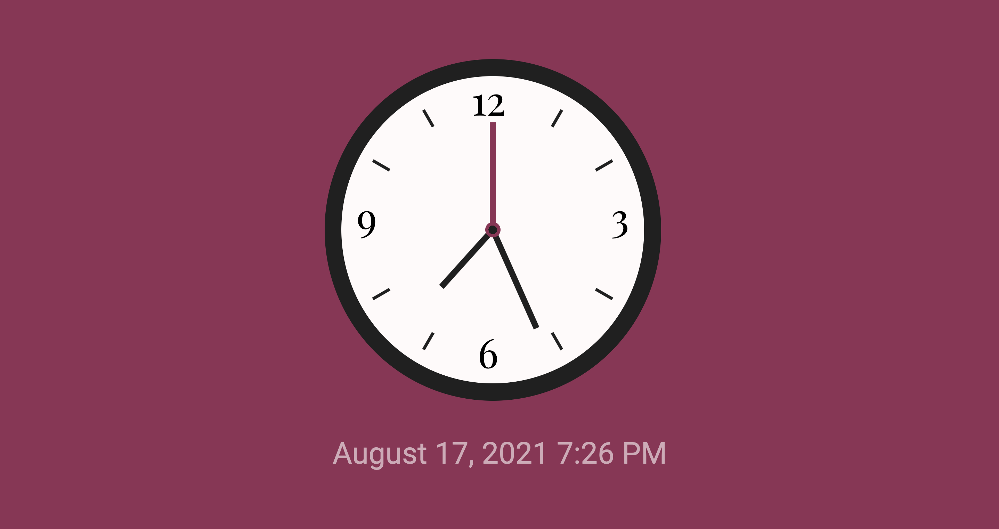

# Mini Projects

**RGB Color Game** - HTML, CSS, JavaScript \
[Codepen](https://codepen.io/aexcode/full/vYmbQNe) | [Github](https://github.com/aexcode/mini-projects/tree/main/projects/rgb-color-game) - August 12, 2021

---

**Tip Calculator** - HTML, CSS, JavaScript \
[Codepen](https://codepen.io/aexcode/full/wvdNwLE) | [Github](https://github.com/aexcode/mini-projects/tree/main/projects/tip-calculator) - August 11, 2021

---

**Calculator** - HTML, CSS, JavaScript \
[Codepen](https://codepen.io/aexcode/full/MWmZmmR) | [Github](https://github.com/aexcode/mini-projects/tree/main/projects/calculator) - August 10, 2021

---

**Analog Clock** - HTML, SCSS, JavaScript \
[Codepen](https://codepen.io/aexcode/full/zYoKbmo) | [Github](https://github.com/aexcode/mini-projects/tree/main/projects/analog-clock) - February 10, 2021
