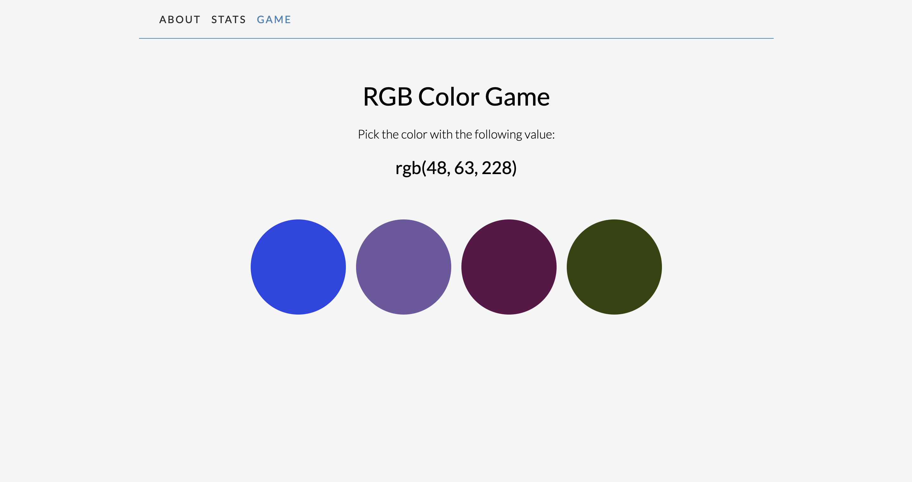
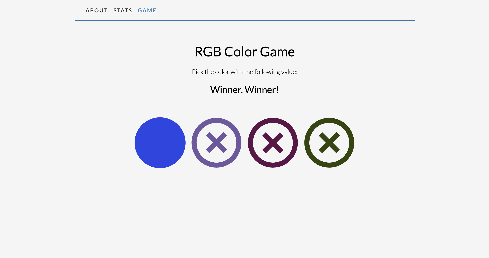
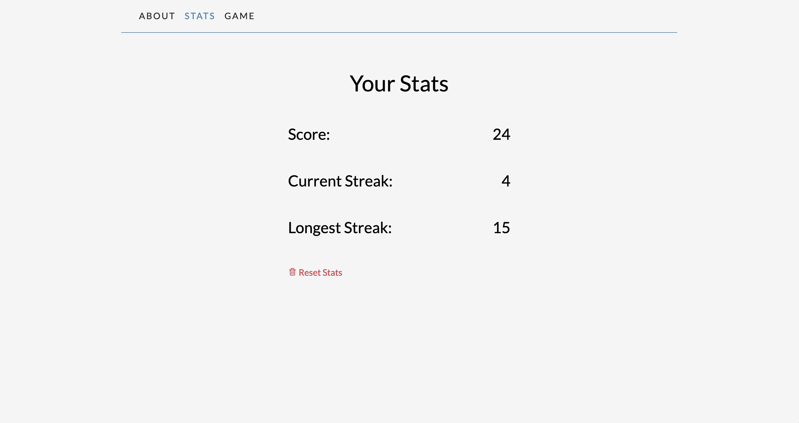
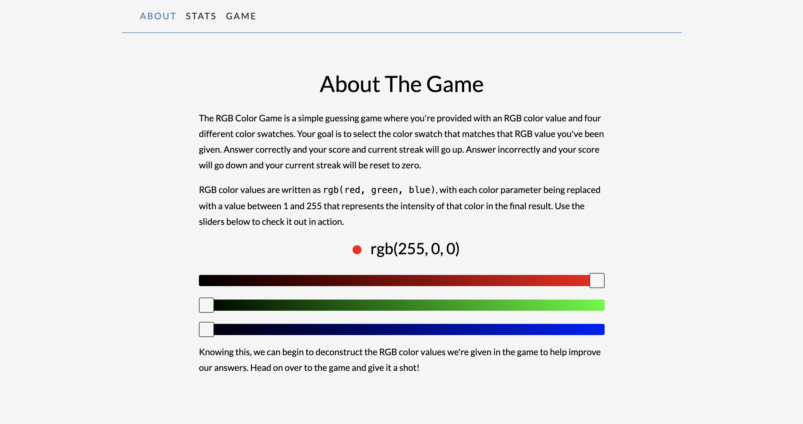

# RGB Color Game

<!-- **Live Demo:** [https://codepen.io/aexcode/full/MWmZmmR](https://codepen.io/aexcode/full/MWmZmmR) -->

## Screenshots

## Description:

A color matching game where users are presented with an RGB color value and a series of color swatches and asked to choose the swatch that matches the given RGB value.

## Tech:

HTML | CSS | JavaScript

## Features:

- [x] Menu with information about the game
- [x] Menu with game stats
- [x] Tracks user's current and longest streak of correct answers
- [x] Stores user's game stats in local storage
- [ ] New longest streak notifications
